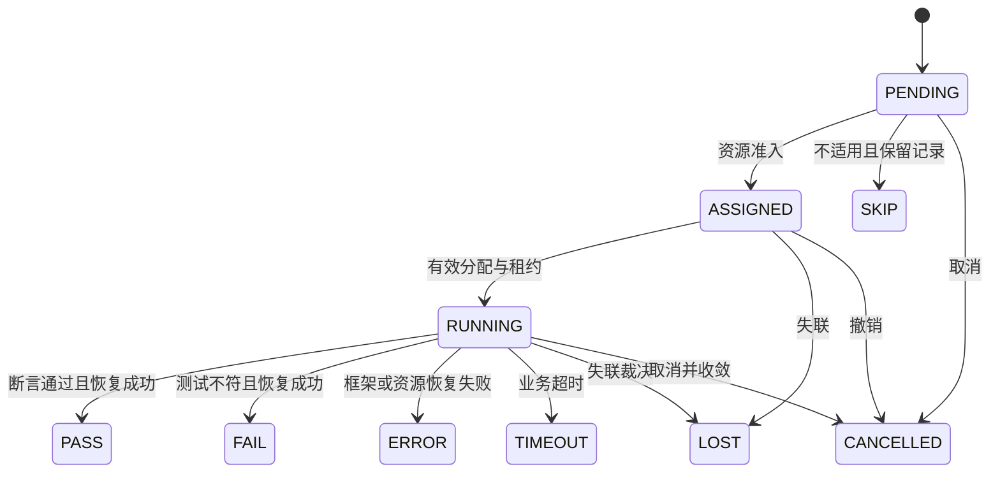

# 架构复核与 v1.1 修订记录

> 日期：2026-09-11 · 本文记录设计修订，不宣称实现完成或性能达标。

## 1. 修订结论

保留 Feature/Test/Coverage Model、Git、双 DSL、Catalog/Selector、两级调度和 Baseline/Delta 的主体设计。
修订重点是让选中的资产、执行的内容、占用的资源、记录的结果和发布口径形成可验证的一致性链路。

## 2. 缺陷与修订映射

| 原缺口 | 本次契约 | 规范位置 | 实现验收 |
|---|---|---|---|
| Catalog 缺 status/issue/覆盖来源 | 补齐字段映射、覆盖表与依赖表 | 04 §28–30、05 §3/25–26 | active/issue 筛选与全量增量等价 |
| Coverage 无可信映射与分母 | 显式 Claim/断言引用、合法点集、五阶段统一分母 | 08 §7/17–18 | 重复点去重，未映射/不支持不隐藏 |
| 结果规范化可能误报或掩盖缺陷 | Canonical 1、类型化 Expected、分帧 Hash 与外部排序 | 02、11 §6–9 | NULL/重复行/精度/时区/大结果反例 |
| Worker 复用后污染 | Cleanup/Reset/Probe、资源健康证明、失败隔离 | 11 §4–5 | 前一 Case 污染不能传给下一 Case |
| Lease 过期但旧任务仍运行 | fencing_token、失租停工、停止证明与 QUARANTINED | 06 §16–22 | 网络分区下不出现双写持有者 |
| 事件只有去重没有状态一致性 | 连续序列、持久化 ACK、终态裁决、迟到审计 | 07 §17/31–33 | 乱序重放一致、LOST 不被旧 PASS 覆盖 |
| 索引与执行源可能漂移 | 不可变 Manifest/Bundle、全依赖指纹 | 05 §19/26、11 §1–3 | 索引后修改文件不能静默执行 |
| Matrix 身份与环境混淆 | 逻辑 target_id 与物理 environment_id 分离 | 06 §9–10、07 §4 | 重试只换物理环境，目标不丢失 |
| Baseline/门禁可能误导 | 显式基线优先、正交差异、可比集合、固定分母 | 10 §3–16/21–22 | 20% unsupported 不能显示 100% 发布通过 |
| Scenario 同步失败语义不明 | 结构化并发、Barrier/Signal 作用域、总超时 | 03 §26–28 | 分支失败后有界结束并清理 |
| MVP 范围与验收冲突 | 最小 Coverage/Attempt/快照前置，生成/分布式后置 | 总架构 §122–127、11 §10–11 | 四类样板闭环与独立性能基准 |

## 3. 实现前必须冻结

- Metadata 1.1 与 Unified Case；04 的枚举、默认值与跨字段约束。
- XGT/Scenario 1.1 语法、Expected 编码、Step ID 与兼容策略。
- Catalog 2、Result 2、Manifest 1（XGMJ1）、Canonical 1（XGC1）；07 定义 Failure Type 语义，机器枚举统一由 registry/failure_types.yaml 派生，不手工维护第二套常量。
- 显式 Coverage Claim、Model ID/Version/Hash、覆盖点分母。
- 资源层级互斥、恢复证明、Attempt/Run 合法迁移与事件 ACK 规则。

定义接口不等于全部功能在 MVP 实现。尚未支持的 DSL/策略/动作必须静态拒绝，不能静默降级。

## 4. 实施顺序

| 阶段 | 交付与边界 |
|---|---|
| Phase 0 | 冻结上述契约和可执行验收样例 |
| Phase 1 | JOIN/UNION/DDL TABLE/STRING FUNCTION，XGT、Catalog、不可变输入、本地 Attempt、隔离、比较、Result、最小手工覆盖 |
| Phase 2 | 约束组合、Generator、Trial Run/Review 和扩展覆盖策略 |
| Phase 3 | Scenario、事务、多 Session、并发取消与同步 |
| Phase 4 | Agent、多集群 Shard/Matrix、Lease/Fencing、恢复与 WAL |
| Phase 5 | Backup/Restore、Cluster/HA、系统级 Adapter |
| Phase 6 | 完整 Baseline/Delta、Result DB、Quality Gate、报表；输入证据从 Phase 1 即保存 |

MVP 不实现 K8s 动态扩容、复杂 UI、AI 生成、Differential/Metamorphic 或 Controller HA。推荐 SQLite Catalog、本地 Bundle/JSONL、静态环境；HTTP/gRPC 到多集群阶段再实现。

## 5. 关键状态示意

所有终态无回退；重试创建新 Attempt。此图是 Attempt 状态视图，资源是否可重新分配仍需独立验证停止与清洁证明。

## 6. 文档和图的一致性

总架构为阅读入口；02–12 为各契约权威规范。架构图保留五平面，强调 Manifest/Bundle、准入与 Fencing、Reset/Probe、WAL/有序投影、可比 Delta 与 Coverage Gap，并显示共享机器契约和工程验收。
原 Query 设计保留背景并标为历史稿。旧 DSL/Result 不能混用新语义；版本升级规则见 README。
每次修订校对：字段映射、失败枚举、状态机、覆盖分母、示例可解析性、Markdown 链接与图文关系。产品行为通过 11 的反例和性能场景另行验收。

## 7. 优化清单评审后的工程化补充

[原清单](XG_DB_Test_v1.1_可优化项_List.md)第 9 节保存 16 项评审结果；总体方向采纳，修改以下不准确或不宜直接实施的部分：

- 资源冲突先判断 resource_id/影响范围，不能使用无资源身份的类型表；Session 不固定属于 Schema。
- 结果比较随业务 Step 完成；最终 Manifest 在选例/目标展开后冻结。
- Schema、枚举与 Core Model 有单向生成关系；解码器负责重复键，领域校验器负责跨字段与状态语义。
- Coverage Review 绑定独立 review_input_hash，不能只记录 reviewer 或只绑定执行 semantic_hash。
- QUARANTINED 恢复证明先于重新准入；env enable 不能变成解封捷径。
- tests/ 保留数据库资产，framework_tests/ 存平台 Contract/Integration/Scenario/Chaos Test。
- Golden Vector、真实故障验证和基础设施门禁按既定阶段落地，未全部前置到 SQL MVP。

新增 [12](12_Machine_Contracts_and_Engineering_Validation.md)作为共享工程规范；05/06/08/10/11 分别补齐 Verify、Admission/Recovery、Claim Review、基础设施门禁、编码/测试/预算。总架构 §135 与图源同步。
