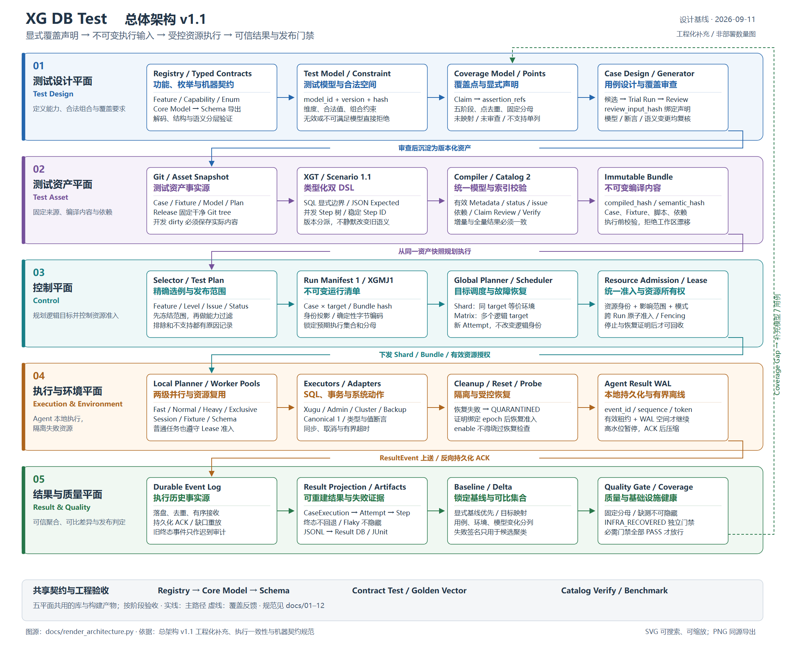

# XG DB Test 设计包 v1.1

当前正式设计基线为 **v1.1（2026-09-11）**。保留五平面架构，补齐数据模型、覆盖、执行一致性、隔离、事件恢复和发布门禁契约。当前仓库以设计为主，文档中的验收标准不代表功能已经实现。

本轮已纳入优化清单的工程化补充：单一契约生成链、Catalog Verify、Claim 审查指纹、资源冲突矩阵、确定性 Manifest 编码与分阶段合约测试。设计版本仍为 v1.1，未宣称新增框架实现。

## 入口

- [总架构](XG_DB_Test_Architecture_Design_v1.md)：完整需求、五平面、模块边界与阶段路线；文件名保留 v1，内容版本为 1.1。
- [修订与验收索引](01_Architecture_Review_and_Refinement.md)：问题、修改位置、实现前必须完成的验证。
- [工程实施顺序与阶段验收](13_Engineering_Implementation_Order_Revised.md)：G0A/G0B 冻结、Driver/Adapter 验证、首批样板，以及 Phase 1–6 的工作包与依赖顺序。
- [优化清单与逐项评审](XG_DB_Test_v1.1_可优化项_List.md)：第 9–10 节解释采纳、调整和原建议中的不准确之处。
- [架构图 SVG](../架构图_v1.svg) / [PNG](../架构图.png)：五平面与可靠执行、质量反馈路径。



## 专项契约

| 文档 | 权威范围 |
|---|---|
| [02 XGT](02_XGT_DSL_Specification.md) | SQL DSL 语法、显式边界、类型化 Expected |
| [03 Scenario](03_Scenario_DSL_Specification.md) | 多会话、并发取消、同步原语和系统动作 |
| [04 Metadata](04_Metadata_Schema.md) | 字段、默认值、继承、跨字段约束与模块映射 |
| [05 Catalog](05_Case_Catalog_Design.md) | 索引表、覆盖与依赖关系、增量一致性 |
| [06 Scheduler](06_Distributed_Scheduler_Design.md) | target/环境、准入、Lease/Fencing、重试与恢复 |
| [07 Result](07_Result_Model_Design.md) | 状态、失败分类、事件顺序、持久化与聚合 |
| [08 Coverage](08_Test_Model_and_Coverage_Design.md) | 显式声明、模型约束、覆盖点、五阶段分母 |
| [09 Lifecycle](09_Case_Lifecycle_and_Generation_Design.md) | 生成来源、Oracle、Trial Run、Review 与状态迁移 |
| [10 Baseline/Delta](10_Release_Baseline_and_Delta_Design.md) | 可比集合、基线选择、差异分类和质量门禁 |
| [11 执行一致性与比较](11_Execution_Consistency_and_Validation_Contract.md) | Manifest/Bundle、哈希、Reset/Probe、Canonical 和验收 |
| [12 机器契约与工程验收](12_Machine_Contracts_and_Engineering_Validation.md) | Registry/Core Model/Schema 单一源、Golden Vector、目录与阶段门禁 |
| [13 工程实施顺序](13_Engineering_Implementation_Order_Revised.md) | 前置条件、首条 JOIN 闭环、各阶段工作包/依赖/交付与验收；不重新定义协议 |

建议顺序：总架构 → 01/12 → 04/08 → 02/03 → 05/11 → 06/07 → 09/10。
准备开工时先读 13，按工作包回查对应专项规范。
同一契约只由上表对应文档定义，其他文档引用或摘要；修改时必须同步总架构与架构图。

## 版本与历史

| 对象 | 本次版本 | 兼容规则 |
|---|---|---|
| 总体设计 | 1.1 | 五平面不变，修订关键契约 |
| XGT / Scenario / Metadata / Agent Protocol | 1.1 | 显式版本分派；旧文件须保留旧解释或审核转换 |
| Catalog | 2 | 与 1 不兼容，rebuild；不改历史结果 |
| Result Schema | 2 | 新事件协议；旧结果仅经显式导入器读取 |
| Canonical / Manifest | 1 | 规范化和内容快照独立版本化 |

Manifest 1 固定采用 XGMJ1 身份编码；数据库结果 Canonical 1 采用 XGC1，两者不同。contract_set_id 标识已发布机器契约集合，正式使用后不得原地改语义或测试向量。

[原 Query 方案](XG_Query_Test_Architecture_Design.md)仅作背景资料，不作为当前实施与工期依据。
没有在本次修订中新增 Web、云调度或自动生成能力范围；现有功能按阶段实施。

## 图源与更新

[render_architecture.py](render_architecture.py)以具名平面、组件和显式关系生成 SVG；图中省略 SQL 级 RPC 和具体部署数量，保留控制/执行边界。

```powershell
python docs/render_architecture.py
```

生成根目录 `架构图_v1.svg`。PNG 必须从同一 SVG 渲染，不能独立手工编辑；使用支持中文字体的浏览器按 SVG 固有尺寸截图/导出。
SVG 保留 title/desc 与可搜索中文文本；小屏幕建议打开原图缩放，正文表格提供文字替代。更新后检查图中文字溢出、连线交叉和文档版本一致性。
